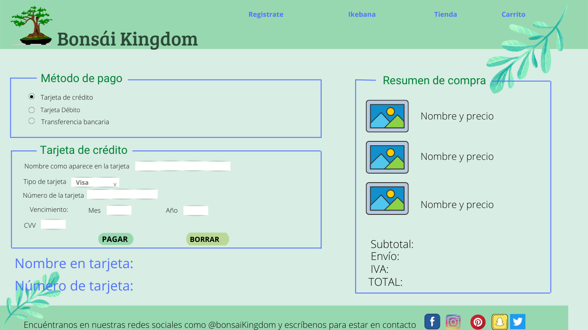

# BONSAI KINGDOM
Proyecto nivel I para el BootCamp 'Desarrollo Web' de Laboratoria. Consistió en desarrollar un validador de tarjetas de crédito utilizando JavaScript vanilla para una aplicación web.
Para dar contexto al proyecto decidí crear la página de pago de una tienda virtual en la que se comercializan bonsáis.
***

## Objetivos de aprendizaje
1. HTML

   [x] Uso semántico de HTML
2. CSS
    
   [x] Uso de selectores
    
   [x] Módelo de caja: borde, margen, padding.
   
3. Web APIs

    [x] Uso de selectores del DOM
    
    [x] Manejo de eventos del DOM: Listeners, propagación, delegación.
    
    [ ] Manipulación dinámica del DOM.
    
4. JAVASCRIPT

    [x] Tipos de datos primitivos
    
    [x] Strings
    
    [x] Variables: declaración, asignación, ámbito.
    
    [x] Condicionales
    
    [x] bucles
    
    [x] Funciones
    
    [x] Pruebas unitarias ==> pasarlas
    
    [] Módulos ECMAScript
    
    [x] Uso de linter (ESLINT)
    
    [x] Uso de identificadores descriptivos.
    
5. CONTROL DE VERSIONES GIT- GITHUB

    [x] Instalación y configuración
    
    [x] Control de versiones: init, clone, add, commit, status, push, pull, remote.
    
    [x] Creación de cuenta y repos, configuración de llaves SSH
    
    [x] Despliegue GitHub Pages
    
6. USER CENTRICITY

    [ ] Diseñar un producto o servicio poniendo a la usuaria en el centro.
    
7. PRODUCT DESIGN

    [ ] Crear prototipos de alta fidelidad que incluyan interacciones
    
    [x] Seguir los principios básicos de diseño visual.

***

# Usuarios y objetivos en relación con el producto
El validador de tarjetas de crédito fue diseñado con las siguientes características:
1. Proporciona seguridad básica para los datos personales y financieros de los clientes
2. Es de fácil usabilidad para los usuarios.
3. Se presenta en concordancia con el estilo visual de la tienda virtual.
4. Identifica cuando una tarjeta de crédito tiene un número válido.
5. Enmascara todos los números de la tarjeta, excepto los últimos cuatro, cuando la tarjeta es válida.

***
# Cómo el producto soluciona los problemas/necesidades de dichos usuarios.
Las tiendas virtuales requieren herramientas simples que les permitan realizar sus ventas, los clientes potenciales quieren entender cómo utilizarlas y además confiar en que sus datos van a encontrarse seguros al realizar sus compras.

***

# Foto del primer prototipo en papel.
Prototipé una web simple con los componentes básicos para poder diferenciar cada Elemento semántico.

***

# Resumen del feedback recibido indicando las mejoras a realizar.
En el feedback de pares se me recomendó aplicar modelo de caja utilizando \

 Para lo cual me encuentro en proceso de exploración.

***
# Imagen del prototipo final.
Prototipo realizado en Canva, sin utilizar prediseños.

