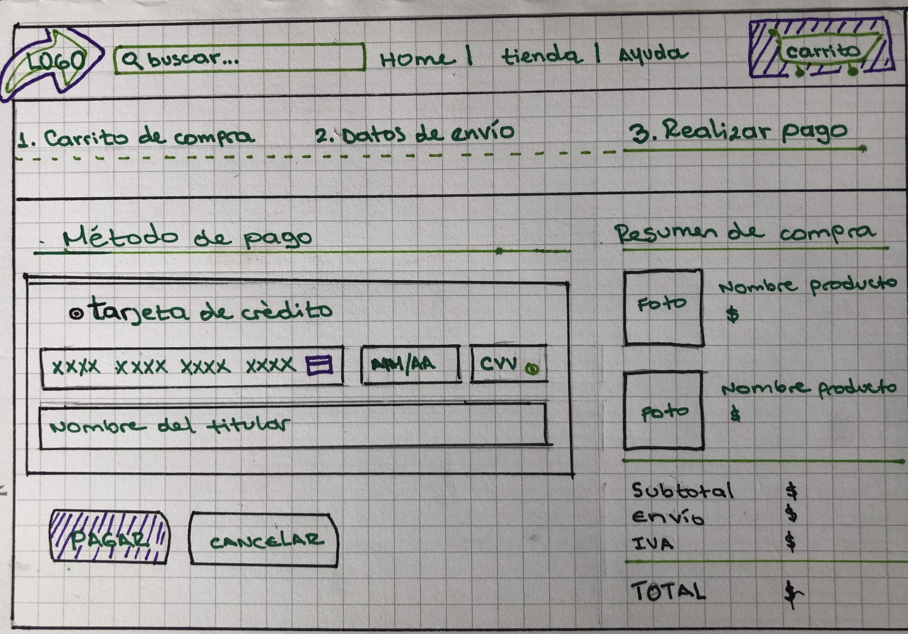

# VALIDADOR DE TARJETAS DE CRÉDITO
Proyecto nivel 1 para el BootCamp de \<Laboratoria>. Desarrollé un validador de tarjetas de crédito utilizando JavaScript vanilla dentro del contexto de una aplicación web.

## Objetivos de aprendizaje
1. Uso semántico de HTML
2. Uso de selectores CSS
3. Web APIs
4. Manejo básico a intermedio de JavaScript (datos primitivos, manipulación de cadenas, variables, condicionales, bucles, funciones, pruebas unitarias)

***

# Usuarios y objetivos en relación con el producto
El validador de tarjetas de crédito fue diseñado con las siguientes características:
1. Proporcionar seguridad básica para los datos personales y financieros de los clientes
2. Ser de fácil usabilidad para los usuarios.
3. Se presente en concordancia con el estilo visual de la tienda virtual.
4. Identifique cuando una tarjeta de crédito tiene un número válido.
5. Enmascare todos los números de la tarjeta, excepto los últimos cuatro, cuando la tarjeta es válida.

# Cómo el producto soluciona los problemas/necesidades de dichos usuarios.
Las tiendas virtuales requieren herramientas simples que les permitan realizar sus transacciones, los clientes potenciales quieren entender cómo utilizarlas y además confiar en que sus datos van a encontrarse seguros al realizar sus compras.

# Foto de tu primer prototipo en papel.

# Resumen del feedback recibido indicando las mejoras a realizar.
Pendiente.

# Imagen del prototipo final.
Pendiente.
